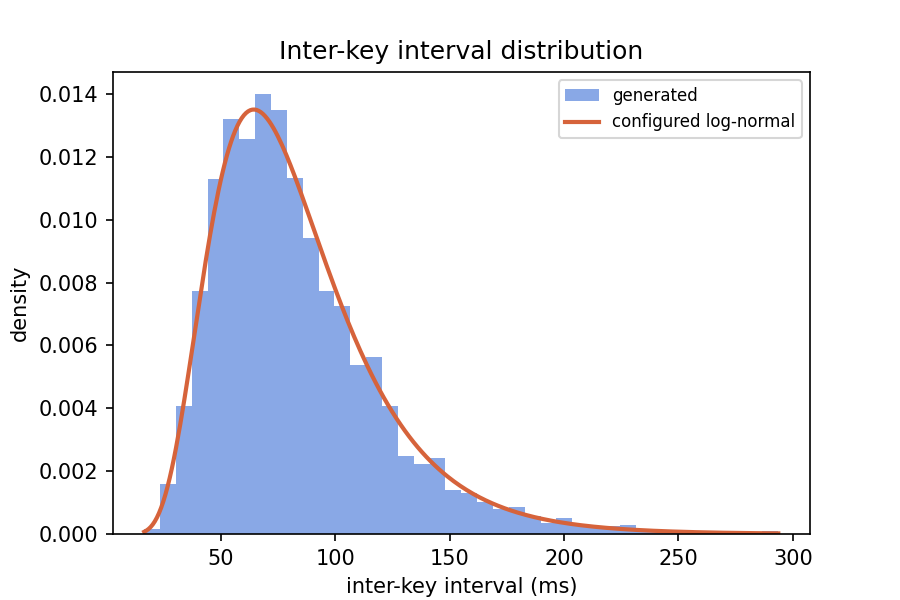
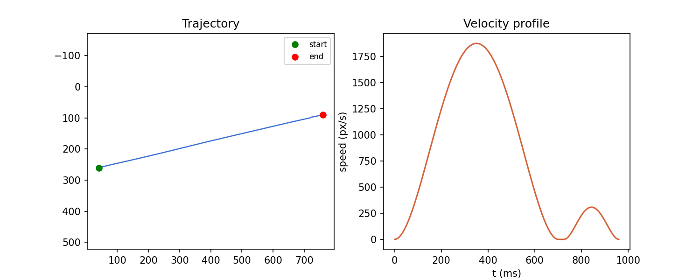

# humaninput

[](https://github.com/humaninput/humaninput/actions/workflows/ci.yml)
[](LICENSE)
[](pyproject.toml)

A statistical model of human input timing — keystrokes and mouse movement — emitted as a timed event stream.

**Use it for:** recording screencasts and demos where instant text insertion looks wrong, generating typing animations for docs and landing pages, and QA-testing UIs that behave differently under realistic input timing than under instantaneous programmatic input (debounce handling, autocomplete races, per-keystroke validation).

<p align="center">
  
</p>

<p align="center"><em>The <code>hunt_and_peck</code> profile typing a sentence — a real generated event stream, rendered by the SVG backend. No hand-authored timing, no keyframe editing.</em></p>

## Core design decision

**The timing engine performs no I/O.** It takes a target string (or a target coordinate) and a profile, and returns a stream of timestamped events. Backends consume that stream and do something with it.

This means the model is unit-testable without touching a screen, the same generated sequence can be replayed into a terminal, an SVG animation, or a JSON file, and statistical validation is possible.

```python
from humaninput import Typist, profiles

t = Typist(profile=profiles.load("touch_typist"), seed=42)
events = t.type("hello world")   # EventStream[KeyEvent], not side effects

for e in events:
    print(e.t_ms, e.action, e.key)   # 0.0 keydown h / 12.4 keyup h / 88.1 keydown e ...
```

Every generator takes a `seed`. Same seed + same profile + same input produces a byte-identical event stream — this is what makes it usable in tests.

## Install

```bash
pip install humaninput            # core: numpy only
pip install humaninput[pynput]    # + real keyboard/mouse control
pip install humaninput[matplotlib]  # + validation plots
```

## Validation

The two images below are read straight off a generated event stream, not illustrations.

<table>
<tr>
<td><br><sub>Generated same-key inter-key intervals (4000 keystrokes) against the profile's configured log-normal — <code>touch_typist</code>, isolated from burst/cognitive pauses.</sub></td>
<td><br><sub>A generated mouse move: mostly-straight trajectory, and a velocity profile showing the ballistic bell curve plus a smaller corrective sub-movement.</sub></td>
</tr>
</table>

`tests/` runs this kind of check as an actual test suite, not just pictures: a Kolmogorov–Smirnov test that intervals match the configured log-normal, an assertion that the digraph class ordering (`same_key < alternating_hand < same_hand_diff_finger < same_finger_diff_key`) holds in generated output, measured WPM within tolerance of `wpm_target`, a linear fit of mouse movement duration against the Fitts index of difficulty (R² > 0.95), a check that the minimum-jerk velocity profile is unimodal and symmetric, seeded-reproducibility checks for every generator, and a round-trip test (generate with profile P, run `fit` on the output, check the recovered parameters land close to P's).

```bash
pip install -e ".[test]"
pytest
humaninput validate --profile touch_typist   # same checks, no pytest required
```

## The model

**Typing.** Inter-key intervals are drawn from a log-normal distribution, not a uniform or Gaussian one — human inter-key intervals are right-skewed, and a Gaussian never produces the long tail that makes generated typing look real. The interval's median is scaled by a **digraph-class multiplier** derived from a keyboard layout table (which hand, which finger, same key vs. same finger vs. different finger): `same_key` fastest, then `alternating_hand`, `same_hand_different_finger` (baseline), `same_finger_different_key` and `to_punctuation`/`from_punctuation` slower, `to_digit` slowest — digits break touch-typing muscle memory. Key **hold duration** (keyup timing) is sampled independently of the inter-key interval, so fast profiles legitimately produce overlapping down/up pairs (rollover) — one of the strongest tells between real and simulated typing. Typing comes in **bursts** (geometric run length) separated by micro-pauses, plus longer **cognitive pauses** before rare words, digit runs, brackets/quotes, sentence starts, and (shorter) after commas.

On top of the per-keystroke noise, overall pace **wanders**: a mean-reverting random walk (Ornstein-Uhlenbeck in log-space, `[pace]` in a profile) multiplies every interval, so a 130-WPM profile doesn't hold a flat 130 — it drifts faster and slower over tens of characters and comes back, the way a real typing session speeds up and slows down rather than metronoming.

**Errors.** Substitution (weighted toward physically adjacent keys), transposition, insertion, and omission each fire at an independent, profile-configured rate — the substitution target is drawn from a weighted-random pool of nearby keys each time, so which wrong key gets hit isn't a fixed per-letter pattern. The important part isn't the error — it's that **detection is delayed** by a few characters (occasionally a whole word), matching how people actually notice typos, followed by a pause and a retype.

The retype itself isn't always a blind backspace-through-everything. With `errors.arrow_correction_probability`, a correction close behind the cursor is fixed in place instead: arrow-left back to it, backspace/retype just that span, arrow-right back out — leaving any correctly-typed characters after it untouched, the way someone reaches back to fix one letter rather than deleting a whole trailing word to get to it. (It only takes this path when nothing else in that stretch still needs fixing; otherwise it falls back to backspace-and-retype, which repairs the whole span at once.) And the retype itself isn't guaranteed correct: `errors.retype_error_rate_multiplier` gives each retyped character a reduced chance of *also* coming out wrong, caught immediately and fixed with one more backspace — fixing a typo can introduce another one, capped by `errors.max_cascade_depth` so it can't chain forever.

**Mouse movement.** Duration comes from Fitts's law, `MT = a + b·log2(2D/W)` (Fitts, 1954), not a fixed or distance-linear duration. The trajectory is not one smooth Bézier curve — real pointing is a **ballistic sub-movement** (~85–95% of the distance) following a **minimum-jerk** velocity profile (Flash & Hogan, 1985: the unique smoothest rest-to-rest trajectory, a symmetric bell-shaped speed curve), then one to three smaller **corrective sub-movements** closing the remaining error, scaling in count with the Fitts index of difficulty, with an occasional overshoot. A low-amplitude value-noise **tremor** is layered on top of the finished path — correlated noise, not independent per-sample jitter, which is what makes it read as a hand instead of static.

**References:** Fitts, P. M. (1954). *The information capacity of the human motor system in controlling the amplitude of movement.* Journal of Experimental Psychology, 47(6), 381–391. · Flash, T., & Hogan, N. (1985). *The coordination of arm movements: an experimentally confirmed mathematical model.* Journal of Neuroscience, 5(7), 1688–1703. · Dhakal, V., Feit, A. M., Kristensson, P. O., & Oulasvirta, A. (2018). *Observations on Typing from 136 Million Keystrokes.* CHI 2018 — digraph-level keystroke latency effects.

## Profiles

Plain TOML data — no source reading required to write one. Shipped in `humaninput/profiles/`:

| profile | notes |
|---|---|
| `touch_typist` | 75 WPM, low error rate, strong rollover |
| `hunt_and_peck` | 30 WPM, high variance, long pauses on digits/symbols, minimal rollover |
| `fast_coder` | 100 WPM on alphanumerics, disproportionately slow on symbols/brackets, high correction rate |
| `mobile_thumbs` | high variance, high adjacent-key substitution rate, word-level autocorrect-style corrections |
| `tired` | `touch_typist` with fatigue drift and elevated error rate |

```toml
name = "touch_typist"
wpm_target = 75

[interval]
distribution = "lognormal"
mu_ms = 128
sigma = 0.42

[digraph_multipliers]
same_key = 0.60
alternating_hand = 0.85
same_hand_different_finger = 1.0
same_finger_different_key = 1.60
to_digit = 2.0
```

Layouts (`humaninput/layouts/`): `qwerty`, `dvorak`, `colemak`, `azerty` — digraph classification is entirely layout-dependent, so alternate layouts are data, not code.

Calibrate against real typing:

```bash
humaninput fit recorded.csv -o my_profile.toml   # csv columns: timestamp_ms,key,action
```

## Backends

Each backend is a consumer of the event stream, with lazily-imported optional dependencies — `import humaninput` never requires any of them.

| backend | dependency | does |
|---|---|---|
| `terminal` | none | replays typing into stdout with real timing (the default) |
| `json` | none | dumps the raw event stream |
| `svg` | none | animated SVG with a blinking cursor, no JS — drop into a README |
| `css_keyframes` | none | a CSS `@keyframes` typing animation for a web page |
| `asciinema` | none | writes a `.cast` v2 file |
| `matplotlib` | `matplotlib` | plots trajectories and interval histograms (validation/figures) |
| `pynput` | `pynput` | drives the **real** OS keyboard/mouse — warns on first use; fail-safe aborts if the cursor hits a screen corner |

## CLI

```bash
humaninput type "text to type"                       # replay to terminal
humaninput type -f script.txt --profile tired
humaninput type "text" --backend svg -o out.svg
humaninput type "text" --backend json -o events.json --seed 42
humaninput mouse --from 100,100 --to 800,600 --target-width 40 --backend json
humaninput fit recorded.csv -o my_profile.toml
humaninput profiles                                   # list available profiles/layouts
humaninput validate --profile touch_typist             # run stat checks, print report
```

## Layout

```
humaninput/
  events.py          # KeyEvent, MouseEvent, EventStream
  profile.py          # TOML loading, validation, defaults, serialization
  layout.py            # digraph classification from a layout table
  layouts/              # qwerty.toml, dvorak.toml, colemak.toml, azerty.toml
  typing/
    model.py             # interval generation, digraph classification, timing
    errors.py            # error injection and correction
    typist.py             # public Typist class
  mouse/
    fitts.py              # Fitts's law
    trajectory.py          # minimum-jerk sub-movements, tremor
    pointer.py             # public Pointer class
  fitting.py            # profile fitting from recorded CSV
  backends/
  cli.py
  profiles/
```

## Word list

`typing/common_words.txt` (top 5000) is used for the rare-word cognitive-pause trigger. Derived from the `first20hours/google-10000-english` list (MIT licensed, itself derived from the Google Trillion Word Corpus).

## Contributing

See [CONTRIBUTING.md](CONTRIBUTING.md). Changes are logged in
[CHANGELOG.md](CHANGELOG.md).

## License

MIT.
